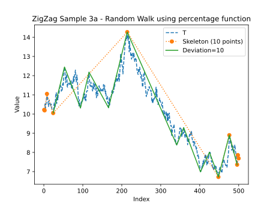

Time series compression for ZigZag indicator
===

**Author:** *Egidijus Andriuskevicius (https://github.com/EA77773)*

December 24, 2023

# Abstract

The ZigZag indicator is a technical analysis tool used in trading to help identify significant price swings in financial time series data for stocks, forex, or commodities. Its primary function is to filter out minor price fluctuations and highlight larger movements, which are often considered more significant for making informed trading decisions.

Traditionally, ZigZag indicators are calculated from already compressed time series, such as hourly or daily charts. However, this traditional approach may introduce inaccuracies and potentially overlook important price swings within shorter time intervals. In this work, we propose an alternative method for compressing raw time series, ensuring the preservation of all price swings that are greater than or equal to a given threshold of swing size. This approach is based on precomputed numeric importance values assigned to individual data points within the time series.

# 1. Introduction

## 1.1 Overview

A time series is a sequence of data points gathered over a period of time. The data points may or may not be spaced at equal time intervals. Each data point in a time series has at least two attributes: an index defining the order in which data points were gathered (i.e. transaction sequence number, chronological point) and a numeric value (i.e. stock price traded in the transaction, temperature reading). Additional attributes, such as a timestamp, transaction volume, or location data, may also be associated with each data point.

The ZigZag indicator filters a financial time series based on a user-defined numeric threshold, known as deviation (also swing size), which is a real positive number, for instance, 5% or $0.5. A higher deviation results in a higher compression rate, filtering out more data points from the time series and producing a smaller ZigZag indicator with longer segments connecting the points within the indicator.

The fundamental property of the ZigZag indicator, calculated with a deviation value $r$, asserts that any reversal within a segment of the indicator must be of a magnitude smaller than than $r$ and the length of any segment in the indicator is either equal to or greater than $r$.

Calculating ZigZag indicator requires a function for measuring the difference (or distance) between two data point values. This function can be as simple as arithmetic subtraction $d(a,b) = b - a$ as well as more complex, such as percentage or logarithms. Different functions may yield different ZigZag indicators for the same time series.

Figure 1. ZigZag indicator calculated with deviation of 10%.

## 2.1 Related work

There are a number of internet web sites <a href="#ref_zigzag">\[ZigZag\]</a> that provide the description of ZigZag indicator as well as source code for its traditional implementation <a href="#ref_zigzag_mt4">\[ZigZag MT4\]</a>.

Fink et al. <a href="#ref_fink">\[Fink, Gandi 2010\]</a> presented a compression technique based on selection of major extrema and discarding the other points, defined the importance levels of extrema and presented a technique for computing them. The compression procedure is controlled by selecting a specific distance function, along with a positive parameter $R$ that determines the compression rate. While the proposed compression procedure may not be explicitly designed for ZigZag indicator calculation, it has the capability to calculate it for certain types of time series.

Yin et al. <a href="#ref_yin">\[Yin, Si, Gong 2010\]</a> proposed a time series segmentation method based on Turning Points which are extracted from the maximum or minimum points of the time series. The proposed segmentation method generates segments at different levels of details. The procedure employs four strategies to filter data points, removing the inner two points from each set of four consecutive points that form a Z-shaped pattern. This pattern is defined by two inequalities and two approximate equalities. Furthermore, the procedure for obtaining the initial level of Turning Points is capable of calculating a longest ZigZag indicator for certain types of time series.

## 2.2 Problem statemment

Traditional methods for calculating the ZigZag indicator have disadvantages and limitations, including:

1. Selecting an optimal deviation often requires prior knowledge about the time series being processed. Unfortunately, this information might not be available, or practical methods to extrapolate it may not exist, especially with large-volume time series. If the chosen deviation value is too high, reprocessing of the entire time series may be necessary with a smaller value. Conversely, if the chosen deviation is too low, recalculating the indicator with a higher value may become necessary.
2. Calculating the indicator with a different difference function may necessitate the reprocessing of the entire time series.
3. While it's possible with minor modifications, traditional methods do not compute the minimum and maximum deviation values for the indicator. The maximum deviation is a value such that calculating a ZigZag indicator with any higher value would produce an empty ZigZag indicator. The minimum deviation is such that, for any lower value, an identical ZigZag indicator is produced. In this work, we introduce a definition of such an indicator, namely the longest ZigZag indicator of a time series. Knowing the minimum and maximum deviation values for an indicator may aid in choosing more optimal deviation values in case the first choice is not suitable.
4. Every time series has a finite number of distinct ZigZag indicators. However, traditional methods fail to reveal statistical properties associated with these distinct indicators, such as their quantity, deviation ranges, or the number of data points in each of them. Access to such information could potentially enhance current methods for time series similarity detection and comparison.

In this work we provide an alternative compression method to address or ameliorate technical disadvantages or limitations associated with the prior art.

# 2. ZigZag compression method

## 2.1 ZigZag importances

Let $T$ be a time series with elements $(t_1, t_2, \ldots, t_n)$, where $n$ is the number of elements, $t_i$ is the value of the data point, and $i$ is its index. We denote its ZigZag indicator, calculated with difference function $d$ and deviation $r$, as $T_{d,r} = (t_{i_1}, t_{i_2}, \ldots, t_{i_m})$, where $m \leq n$ is the number of elements, and $t_{i_j}$ represents the $j$-th element in $T_{d,r}$ with $i_j$ being the index of the corresponding data point in $T$. We employ signed real-valued functions for measuring difference, with the sign denoting positive (increase) or negative (decrease) changes between values. Notably, the absolute difference serves as both the distance between two data points and the length of the connecting segment, measured solely in the value dimension (time dimension ignored).

> Example: Difference functions
>
> This example highlights how different difference functions can lead to contrasting interpretations of price swings. Let's consider two price swings: A from $1.00 to $1.20 and B from $0.10 to $0.20 in a financial time series. Using arithmetic subtraction as the difference function, A has a swing size of $0.20 and B has a swing size of $0.10, making A appear larger. However, when we consider the percentage difference, A has a 20% swing and B has a 100% swing, making B appear significantly larger.

In the case of ZigZag indicators derived from the same time series with progressively increasing deviation values ($r_1 < r_2$), optimisation of calculations can be achieved by utilising a lower-deviation indicator ($T_{d,r_1}$) as the starting point for the subsequent iteration ($T_{d,r_2}$), rather than processing the raw data ($T$) each time.

We introduce a non-constructive definition of ZigZag importance:

For a given time series $T$ and difference function $d$, the ZigZag numeric importance of a data point $t_i$ is a deviation value $r_i$ such that for any $r \leq r_i$, $t_i \in T_{d,r}$ and for any $r \gt r_i$, $t_i \notin T_{d,r}$. In essence, $r_i$ denotes the maximum deviation value for which $t_i$ is included in a ZigZag indicator when the same time series is processed using the identical ZigZag calculation formula and difference function.

Real-life time series include data points that do not feature in any ZigZag indicator, regardless of how small the chosen deviation value may be. For convenience, we assign an importance value of $0$ to these data points. Such points are typically situated within both increasing or decreasing segments absent of reversals, as well as extrema comprising multiple identical points.

Suppose we can efficiently compute the ZigZag importance value for each $t_i$ in a time series $T$ and as a result generate a vector $L_{T, d} = (r_1, r_2, \ldots, r_n)$, where $r_i$ represents the importance of $t_i$ for a given difference function $d$. Then calculating the ZigZag can be achieved by filtering data points and applying $L_{T, d}$ as a filter, which mathematically can be expressed as $T_{d, r} = (t_i: r_i \geq r, t_i \in T, r_i \in L_{T, d})$.

For increasing deviations $r_1 \lt r_2$, we can enhance the efficiency of calculating the higher-deviation indicator ($T_{d, r_2}$) by reapplying the filter to the points from the lower-deviation indicator ($T_{d, r_1}$). This optimisation can be mathematically expressed as $T_{d, r_2} = (t_{i_j}: r_{i_j} \geq r_2, t_{i_j} \in T_{d, r_1}, r_{i_j} \in L_{T, d})$. Notably, this approach differs from the optimisation used in traditional methods, where the entire ZigZag calculation procedure is reapplied to the previously computed indicator with a lower deviation.

> Fact: Maximum Deviation Value in $L_{T, d}$
>
> Even without computing $L_{T, d}$ we can determine its maximum value: $max_r=|d(min(t_i), max(t_i))|$. All minimum and maximum points in $T$ will have an importance value of $max_r$.

## 2.2 Longest ZigZag indicator of time series

The ZigZag indicator represents a ZigZag sequence, where differences between successive elements strictly alternate between positive and negative in a zigzag pattern. To express it mathematically, a sequence $Z=(t_1,t_2,\ldots,t_n)$ is considered a ZigZag sequence if:

1. $n=1$, or
2. when $n = 2$ then $t_1 \neq t_2$, or
3. when $n \geq 3$ then for any $1 \lt i \lt n$ either $t_{i-1} \lt t_i \gt t_{i+1}$ or $t_{i-1} \gt t_i \lt t_{i+1}$

The longest ZigZag subsequences of a time series $T$ are all subsequences that satisfy the ZigZag sequence properties and achieve the maximum possible length. While multiple such subsequences may coexist within a single time series, not every one of them may qualify as a ZigZag indicator.

> Note: A subsequence is a sequence derived from another by omitting a number of elements. This implies that the elements selected into the subsequence do not have to be consecutive in the original time series. However, the original order must be maintained.

We next define the longest ZigZag indicator.

We say $Z=(t_{i_1},t_{i_2},\ldots,t_{i_m})$ is a longest ZigZag indicator of time series $T$ if:

1. $Z$ is a longest ZigZag subsequence of $T$; and
2. either $m=1$ or
3. $min(t_{i_j},t_{i_{j+1}}) \leq t_k \leq max(t_{i_j},t_{i_{j+1}})$, for any $0 \lt j \lt m$ and any $i_j \lt k \lt i_{j+1}$.

The third condition ensures that the value of each excluded point, positioned between two consecutive points from the indicator, falls within the range defined by the values of those two closest neighbouring points within the indicator.

While some might argue that a time series should only have one longest ZigZag indicator, necessitating additional conditions to the definition, we accept the possibility of multiple valid longest indicators for the purposes of this work.

The definition of the longest ZigZag indicator of $T$ is independent of the difference function employed. This implies that the calculation of the longest indicator does not rely on a specific difference function, and the set of all longest indicators of $T$ is universal for any difference function.

> Conjecture: All longest ZigZag indicators of a time series $T$ are identical sequences of data point values, differing solely in their indexes within $T$.

> Example: Longest ZigZag Subsequences and Indicators
>
> Consider a time series with elements (index, value) as ((1, 1), (2, 8), (3, 10), (4, 4), (5, 4), (6, 7)). This time series has four longest ZigZag subsequences:
>
> 1. ((1, 1) < (2, 8) > (4, 4) < (6, 7))
> 2. ((1, 1) < (2, 8) > (5, 4) < (6, 7))
> 3. ((1, 1) < (3, 10) > (4, 4) < (6, 7))
> 4. ((1, 1) < (3, 10) > (5, 4) < (6, 7))
>
> Note that only subsequences 3 and 4 satisfy the additional criteria for being ZigZag indicators. These two indicators have identical data point values but differ only in their indexes (element 3).

### 2.2.1 Algorithm for calculating longest ZigZag indicator

Suppose $T=(t_1,t_2,\ldots,t_n)$ is a time series. The following procedure outlines the steps to calculate a longest ZigZag indicator $Z$ of $T$:

1. Load $Z=(t_{i_j})$ with $T$, where initially $m=n$, $1 \leq j \leq m$ and $i_1=1,i_2=2,\ldots,i_m=n$.
2. Identify one set of either
two ($t_{i_j}$ and $t_{i_{j+1}}$) or
three ($t_{i_{j-1}}$, $t_{i_j}$ and $t_{i_{j+1}}$)
consecutive points from $Z$
that satisfies the following conditions
and apply the corresponding rule:
    1. For two points, if $t_{i_j} = t_{i_{j+1}}$, remove from $Z$ either $t_{i_j}$ or $t_{i_{j+1}}$.
    2. For three points, if $t_{i_{j-1}} \lt t_{i_j} \lt t_{i_{j+1}}$ or $t_{i_{j-1}} \gt t_{i_j} \gt t_{i_{j+1}}$, remove from $Z$ $t_{i_j}$.
3. Continue iterating through step 2 until no sets of two or three consecutive points from $Z$ satisfy any of the specified conditions. In each iteration, select points from and apply the corresponding rule to the resulting subsequence $Z$ from the previous iteration, excluding points that have already been removed.

The order of data point testing in step 2 is left undefined, allowing for optimisation strategies specific to the implementation. It's worth noting that the two conditions exhibit a dependency; if either pair of two consecutive points within a set of three consecutive points satisfies condition 2.i, then condition 2.ii will be unsuccessful for that particular trio of points.

## 2.3 ZigZag compression

Our ZigZag compression method involves computing ZigZag importances $L_{T, d} = (r_1, r_2, \ldots, r_n)$, which is subsequently utilised to calculate the ZigZag indicator itself.

Suppose $Z_1=(t_{i_{1}},t_{i_{2}},\ldots,t_{i_{m1}})$ is a longest ZigZag indicator of time series $T=(t_1,t_2,\ldots,t_n)$, where $m1 \leq n$. We assign the importance value of zero to $r_i$ for any $t_i$ not in $Z_1$.

Subsequently, we identify the shortest segments in $Z_1$ for a given difference function $d$. Let $d_1=min(|d(t_{i_{j}}, t_{i_{j+1}})|)$ where $1 \leq j \lt m1$. Since $d_1$ is the length of shortest segments in a longest indicator, which has no reversals, then $Z_1$ represents the ZigZag indicator $T_{d,r}$ for any chosen $r \leq d_1$. Consequently, for any chosen $r' \gt d_1$ the shortest segments and their endpoints must be excluded from any indicator $T_{d,r'}$.

Let $Z_2=(t_{i_{1}},t_{i_{2}},\ldots,t_{i_{m2}})$ be a longest ZigZag indicator of $Z_1$ (not $T$), such that excludes all the shortest segments with length $d_1$.
The construction of $Z_2$ involves iteratively identifying and selecting a shortest segment of length $d_1$ in $Z_1$, removing the minimum number of points from the subsequence so that the selected segment is eliminated, and ensuring that the reduced subsequence remains a ZigZag sequence.
Each iteration of selection is applied to the resulting subsequence from the previous iteration, excluding points that have already been removed in the previous iterations.
If the shortest segment is the first (last), only the first (last) point in the sequence needs to be removed.
In all other cases, the two endpoints of the identified segment are removed.
This elimination is repeated until no segments of length $d_1$ remain in the subsequence.
Removing two consecutive points eliminates three consecutive segments from the subsequence.
One or both removed outer segments may be shortest, which means that by removing two points, we may eliminate two or three shortest segments in the same iteration.
For $k$ consecutive shortest segments in the subsequence, where outer segments are not the first or last, regardless of the removal order, in the end, $k+1$ points will be removed when $k$ is an odd number, and $k$ points will be removed when $k$ is even.

For each point $t_{i_j}$ removed from $Z_1$ to derive $Z_2$, $d_1$ represents the maximum deviation value of all possible ZigZag indicators in which those points are still included. Any deviation value higher than $d_1$ results in their exclusion. Therefore, we assign the value $d_1$ to their ZigZag importance $r_{i_j}$.

We repeat the procedure above to compute $Z_i$ from $Z_{i-1}$ until the last $Z_i$ is reduced to an empty set. Note that, in a special case, where $Z_1$ has only one element the process cannot be applied therefore for the consistency we simply remove the only element and assign a value of $0$ to its importance.

At the end of this process, $L_{T, d}$ is computed where every point in the time series is assigned with their ZigZag importance value.

We note, that in the procedure above the order in which shortest segments are selected and tested is not defined. Choosing a different order may result in a different importances vector $L_{T, d}$; nevertheless, any such vector remains valid.

> Conjecture: All distinct ZigZag importances $L_{T, d}$ derived from the same time series $T$ are permutations of one another.

The primary goal of our compression method is to compute $L_{T, d}$, allowing us to reconstruct all intermediate indicators calculated in the above process. While the procedure outlined above effectively reveals the mathematical structure of ZigZag indicators, it is not an efficient method for computing ZigZag importances. This approach iterates through all possible thresholds (from lowest to highest) of ZigZag deviations at which the ZigZag indicator drops its points. Consequently, this process generates a sequence of all distinct ZigZag indicators, where each is a ZigZag subsequence in relation to the preceding one.

In the next section, we present a fast procedure for computing ZigZag importances.
We note that, in the procedure above, except for the first and last segments in the subsequence, the identified shortest segment for removal is consistently positioned in the middle of a Z-shaped formation of three segments. In this formation, the middle segment is always shorter than or equal in length to the two outer segments.
Experimental results have shown that iteratively, in no specific order, identifying such Z-shaped formations, removing its inner two points and, as per the procedure, assigning the absolute difference of the two removed points to their importance values, consistently computes valid ZigZag importances.

### 2.3.1 Algorithm for computing ZigZag importances

Suppose $T=(t_1,t_2,\ldots,t_n)$ is a time series and $d$ is a difference function. The following procedure outlines the steps to compute ZigZag importance values $L_{T, d}=(r_1,r_2,\ldots,r_n)$ for data points in $T$:

1. Load skeleton $S=(t_{i_j})$ with $T$, where initially $m=n$, $1 \leq j \leq m$ and $i_1=1,i_2=2,\ldots,i_m=n$.
2. Identify one set of either
two ($t_{i_j}$ and $t_{i_{j+1}}$)
or three ($t_{i_{j-1}}$, $t_{i_j}$ and $t_{i_{j+1}}$),
or four ($t_{i_j}$, $t_{i_{j+1}}$, $t_{i_{j+2}}$ and $t_{i_{j+3}}$)
consecutive points from $S$
that satisfies the following conditions
and apply the corresponding rule:
    1. For two points, if $t_{i_j} = t_{i_{j+1}}$, remove either $t_{i_j}$ or $t_{i_{j+1}}$. For the removed point, set $r_{i_j}$ or $r_{i_{j+1}}$ to $0$ accordingly.
    2. For three points, if $t_{i_{j-1}} \lt t_{i_j} \lt t_{i_{j+1}}$ or $t_{i_{j-1}} \gt t_{i_j} \gt t_{i_{j+1}}$, remove $t_{i_j}$ and set $r_{i_j}$ to $0$.
    3. For four points, if $t_{i_j} \leq t_{i_{j+2}} \lt t_{i_{j+1}} \leq t_{i_{j+3}}$ or $t_{i_j} \geq t_{i_{j+2}} \gt t_{i_{j+1}} \geq t_{i_{j+3}}$, remove both $t_{i_{j+1}}$ and $t_{i_{j+2}}$ and set both $r_{i_{j+1}}$ and $r_{i_{j+2}}$ to $|d(t_{i_{j+1}}, t_{i_{j+2}})|$.
3. Continue iterating through step 2 until no sets of two or three or four consecutive points from $S$ satisfy any of the specified conditions. In each iteration, select points from and apply the corresponding rule to the resulting subsequence $S$ from the previous iteration, excluding points that have already been removed.
4. For the remaining points in $S = (t_{i_1}, t_{i_2}, \ldots, t_{i_m})$:
    1. If $m=1$, set $r_{i_1}$ to $0$, otherwise
    2. Set $r_{i_1}$ to $|d(t_{i_1}, t_{i_2})|$ and $r_{i_m}$ to $|d(t_{i_{m-1}}, t_{i_m})|$.
    3. If $m>2$ set $r_{i_j}$ to $max(|d(t_{i_{j-1}}, t_{i_j})|,|d(t_{i_j}, t_{i_{j+1}})|)$.

In the procedure above, rules 2.1 and 2.2 are the same as in the longest ZigZag indicator algorithm. In fact, a longest ZigZag indicator can be generated from importances $L_{T, d}$ by selecting all points $t_i$ such that $r_i \gt 0$. Rule 2.3 is met when three segments are arranged in a Z-shaped formation, where the middle segment is shorter than or equal in length to the two outer segments.

Similar to the previous algorithm, the testing order of data points in step 2 is undefined, making any order valid. Additionally, if the condition in rule 2.i is satisfied, then condition in 2.ii will fail for the same points. Likewise, if 2.ii is satisfied, 2.iii will fail.

The conditions for the rules in step 2 can be expressed using the difference function $d$, which may lead to a more efficient implementation. However, such a difference function must satisfy the following two axioms for any real values $a$, $b$ and $c$:

- $d(a,b)=-d(b,a)$
- $a \lt b \lt c$ if and only if $0 \lt d(a,b) \lt d(a,c)$

Then we can rewrite the conditions as it follows:

2.i $d(t_{i_j}, t_{i_{j+1}}) = 0$

2.ii Condition 2.i fails, and $sgn(d(t_{i_{j-1}}, t_{i_j})) = sgn(d(t_{i_j}, t_{i_{j+1}}))$

2.iii Both conditions 2.i and 2.ii fail, and $|d(t_{i_j}, t_{i_{j+1}})| \geq |d(t_{i_{j+1}}, t_{i_{j+2}})| \leq |d(t_{i_{j+2}}, t_{i_{j+3}})|$

The worst case scenario for this ZigZag compression is time series where no points can be removed in step 2 and the skeleton size remains the same as the size of the original time series. Such time series are ZigZag sequences that diverge and then/or converge at every point, which mathematically can be expressed as:
$|d(t_1, t_2)| \lt |d(t_2, t_3)| \lt \ldots \lt |d(t_{i-1}, t_{i})| \gt |d(t_{i}, t_{i+1})| \gt \ldots \gt |d(t_{n-1}, t_n)|$.

The inequality above also defines the shape of the final skeleton $S$, where no more points can be removed. With real-life financial time series the skeleton size is typically reduced to under 20 points. This is important for compressing continuously streaming time series as it allows efficient in-memory storage throughout the process. For such time series, new data point(s) can be appended to the skeleton as they arrive, and then evaluated as per step 2. Our experimentation has shown that when compressing a set of 1.5 million EUR/USD tick prices the size of $S$ did not exceed 14 points.

## 2.4 ZigZag recompression

Recompression is the process of recalculating ZigZag importances for a previously compressed time series using a different difference function. Initially, a time series can be compressed using a difference function that demands minimal computations, and subsequently, it can be recompressed with more complex difference functions. The interchangeability of difference functions is contingent upon their adherence to the two axioms outlined in the preceding section.

To achieve recompression, it involves preserving pairs of removed points as per rule 2.iii and retaining the final skeleton $S$ during step 4 of the algorithm for computing ZigZag importances. Subsequently, the new importance values can be recalculated for the same pairs using the new difference function.

# 3. Conclusions and future work

## 3.1 Conclusions

We have developed an algorithm for computing the ZigZag importances, enabling the fast compression of a time series to efficiently generate a ZigZag indicator with a given deviation value. Notably, our proposed compression method eliminates the need for the preselection of a minimum deviation value. Additionally, we offer a fast recompression algorithm using an alternative difference function, thereby mitigating the need for reprocessing of the entire time series. The resulting ZigZag importances provide valuable data for analysing the statistical properties of its associated ZigZag indicators.

## 3.2 Aggregate values

In the analysis of time series data, segmenting and computing aggregate values, such as trading transaction volumes and weighted averages, can be instrumental. An aggregate value represents a segment of one or more data points within a time series in the form of a summary value such as an average or mean. Traditionally, aggregate values for a time series are computed with respect to fixed time interval segments, where the time series is partitioned based on predetermined time intervals, such as one hour or day. Within the ZigZag indicator, the time series is segmented based on the deviation value. It may be advantageous to ascertain aggregate values corresponding to each segment within the indicator.

We have developed and are preparing for publishing an enhancement to the compression algorithm presented in this work, enabling the computation of aggregate values at the same time as performing the ZigZag compression of a time series. This enhancement involves the precomputation of aggregate values for all potential segments within any ZigZag indicator of a time series to be generated with any deviation value. The precomputed aggregate values can be stored on a secondary storage and later retrieved together with a ZigZag indicator for any specified deviation value.

## 3.3 Formalising ZigZag indicator

Often, the ZigZag indicator is defined through a formula or algorithm, primarily within the context of financial technical analysis. A more rigorous and formal definition, coupled with a detailed analysis of its mathematical properties, has the potential to broaden its applicability beyond the financial domain.

# References

\[ZigZag\] Zig Zag Indicator: Definition, How Pattern Is Used, and Formula https://www.investopedia.com/terms/z/zig_zag_indicator.asp

\[Fink, Gandi 2010\] Eugene Fink, Harith Suman Gandhi. Compression of Time Series by Extracting Major Extrema. In Journal of Experimental & Theoretical Artificial Intelligence, 23, 23, 255-270.

\[Yin, Si, Gong 2010\] Jiangling Yin, Yain-Whar Si, Zhiguo Gong. Financial Time Series Segmentation Based On Turning Points. In Proceedings of 2011 International Conference on System Science and Engineering, Macau, China - June 2011.

\[ZigZag MT4\] ZigZag - indicator for MetaTrader 4 https://www.mql5.com/en/code/7796
